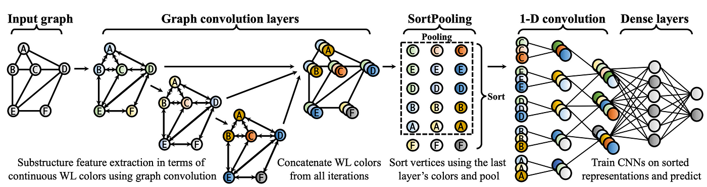

PyTorch Implementation of Graph Convolutional Networks based on the papers:

- https://arxiv.org/pdf/1606.09375
- https://arxiv.org/pdf/0912.3848
- https://arxiv.org/pdf/1609.02907.pdf

Note: The original paper implements GCN using ReLU as the activation function. This repository uses softmax. 