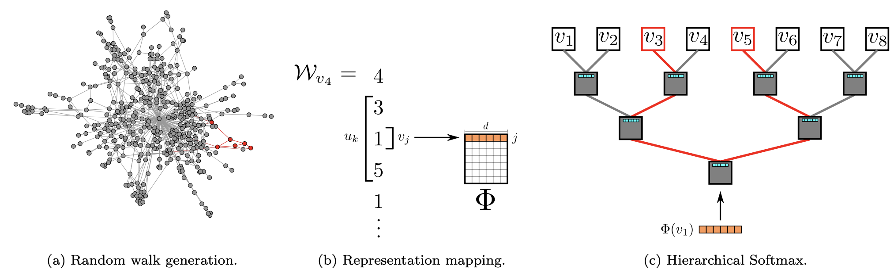

# Node Feature Representation Learning

Given a network G = (V, E) our goal is to learn a mapping function f : V -> ℝ^d that assigns each node a d-dimensional feature representation. Equivalently, f is a |V| x d matrix. For each node u ∈ V, we define its neighborhood N_S(u) ⊆ V using a sampling strategy S.

The graph emebdding techniques are analogius to text embedding, so the following papers include text embedding papers that inspired the graph embedding work.

Papers:

- Distributed Representations of Words and Phrases and their Compositionality : https://arxiv.org/pdf/1310.4546
- Node2Vec, Scalable Feature Learning for Networks : https://arxiv.org/pdf/1607.00653
- DeepWalk, Online Learning of Social Representations: https://arxiv.org/pdf/1403.6652
- LINE: Large-scale Information Network Embedding : https://arxiv.org/pdf/1503.03578
- Network Embedding as Matrix Factorization: Unifying DeepWalk, LINE, PTE, and node2vec: https://arxiv.org/pdf/1710.02971

